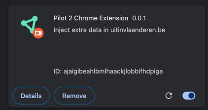
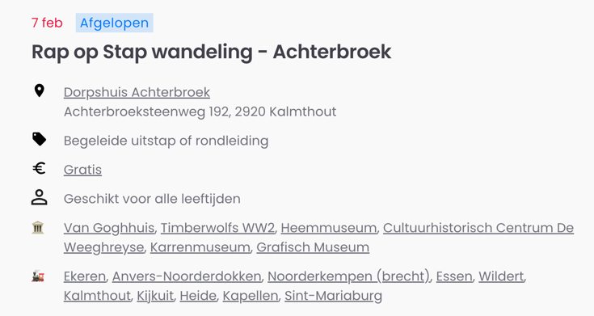

# serendipity-engine-pilot-2-chromeUsage

1. Install dependencies via

   ```shell
   npm i
   ```

2. Start continuous building via

   ```shell
   npm start
   ```

3. Open Chrome.
4. Navigate to <chrome://extensions/>.
5. Click on "Load unpacked".
6. Navigate to the `dist` folder in this repo.
7. Click on "Select".
8. The extension is loaded:
   
9. Navigate to
   <https://uitinvlaanderen.be/agenda/e/rap-op-stap-wandeling-achterbroek/746ee4e0-2083-4924-bd28-f76186962e2d>.
10. The extension adds two rows with info about museums and train stations:
      
11. Navigate to
    <https://uitinvlaanderen.be/agenda?data-focus=search-term>.
12. Click on one of the events.
13. The extension adds again two rows with info:
    

## License

This code is copyrighted by [Ghent University – imec](http://idlab.ugent.be/) and
released under the [MIT license](http://opensource.org/licenses/MIT).
